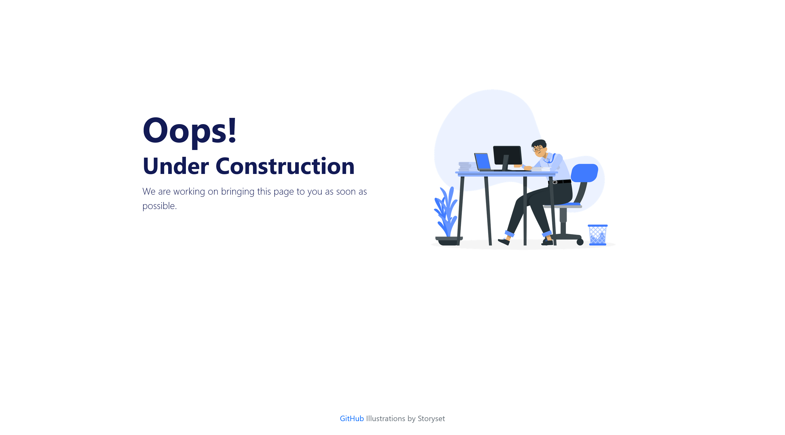

# Project Name

🚧 Under Construction Landing Page 🚧

A clean and simple landing page indicating that the project is under construction, built with HTML and Bootstrap 5.

## Table of Contents

- [Demo](#demo)
- [Usage](#usage)
- [Contributing](#contributing)
- [Illustrations](#illustrations)
- [License](#license)

## Demo

<a href="https://utano.dev/wip">View Demo</a>

## Usage

Simply open the `index.html` file in a web browser to view the "Under Construction" landing page.

## Contributing

If you'd like to contribute to this project, follow these steps:

1. Fork the repository.
2. Create a new branch (`git checkout -b feature/your-feature-name`).
3. Commit your changes (`git commit -m 'Add some feature'`).
4. Push to the branch (`git push origin feature/your-feature-name`).
5. Open a pull request.

## Illustrations

Illustrations used in this project are provided by <a href="https://storyset.com/work">Storyset</a>.

## License

This project is licensed under the [MIT License](LICENSE.md) - see the [LICENSE.md](LICENSE.md) file for details.
